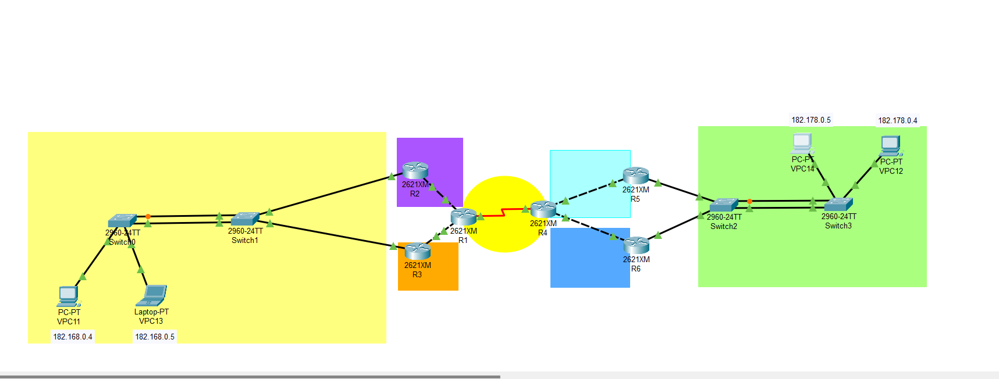
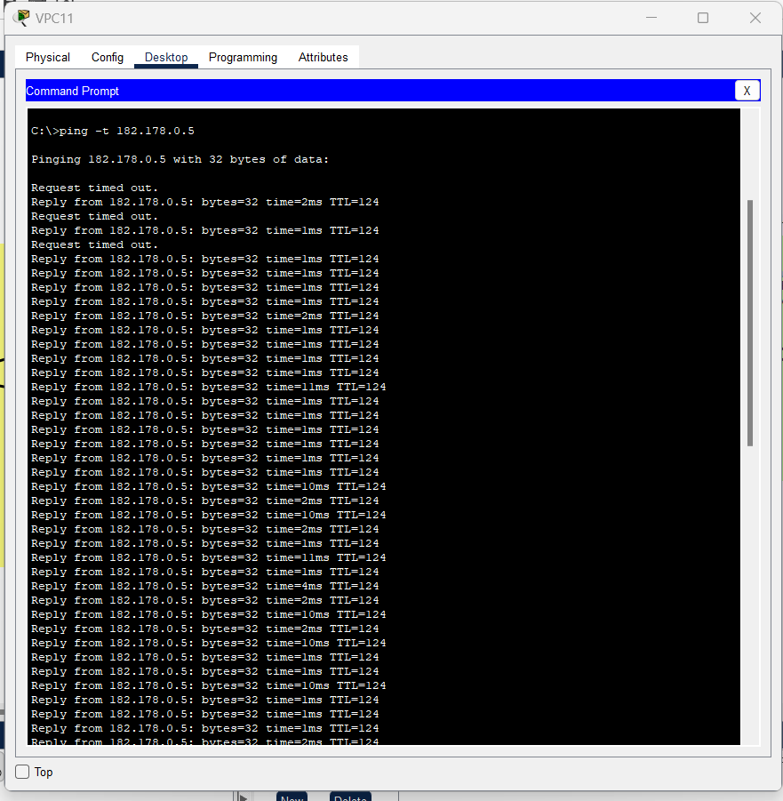
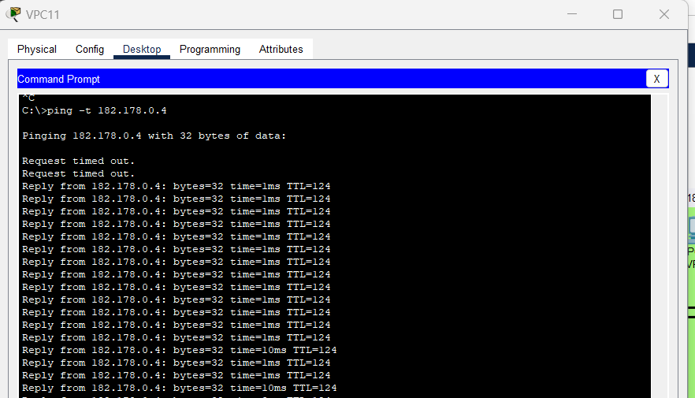
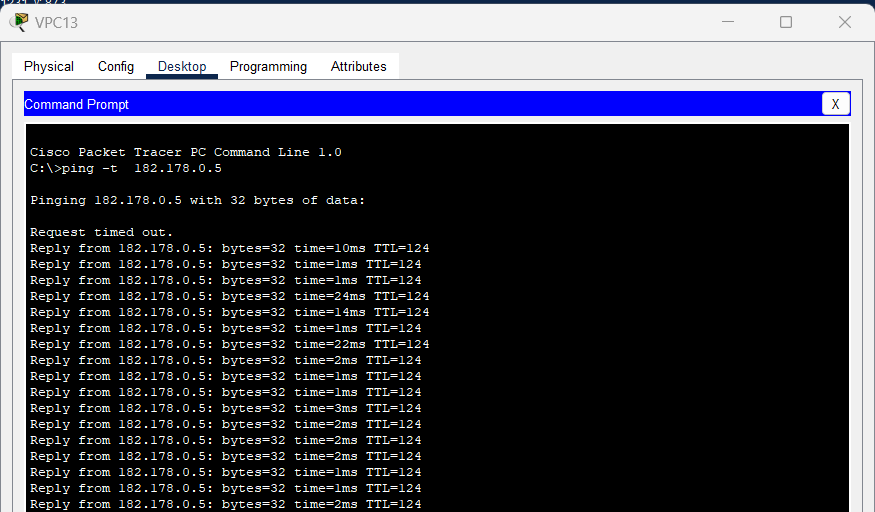
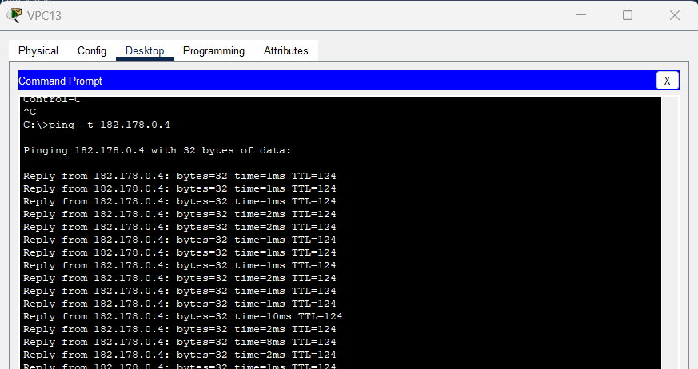
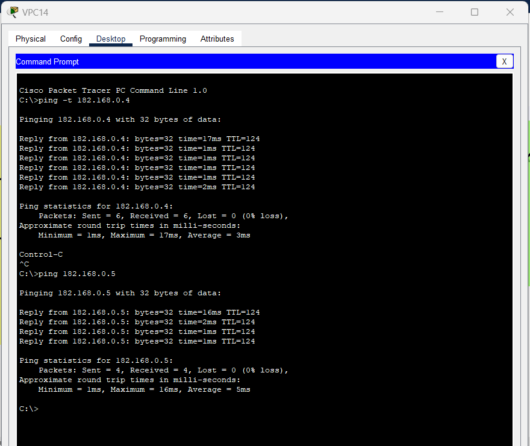
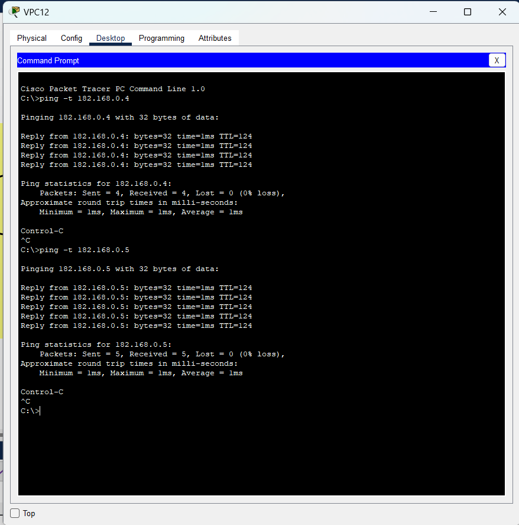

# Manual Técnico🔧

# Universidad de San Carlos de Guatemala


# Facultad de Ingenieria, escuela de Ciencias y Sistemas

# Redes de Computadoras 1️⃣

# Topología 📡



# PRUEBAS DE PING 📶

## VPC1️⃣1️⃣ - Parte 1️⃣



## VPC1️⃣1️⃣ - Parte 2️⃣



## VPC1️⃣3️⃣ - Parte 1️⃣



## VPC1️⃣3️⃣ - Parte 2️⃣



## VPC1️⃣4️⃣



## VPC1️⃣5️⃣



## CONFIGURACIONES DE ROUTERS 🗣️

# ROUTER1️⃣

```bash
enable
configure terminal
hostname R1
no ip domain-lookup

interface s0/0
ip address 10.0.0.1 255.255.255.252
no shutdown

interface f0/0
ip address 182.168.1.2 255.255.255.248
no shutdown

interface f0/1
ip address 182.168.2.2 255.255.255.248
no shutdown

ip route 10.0.0.0 255.255.255.252 10.0.0.2
ip route 182.168.0.0 255.255.255.0 182.168.1.1
ip route 182.168.0.0 255.255.255.0 182.168.2.1
ip route 182.168.1.0 255.255.255.248 182.168.1.1
ip route 182.168.2.0 255.255.255.248 182.168.2.1
ip route 182.178.0.0 255.255.255.0 10.0.0.2
ip route 182.178.1.0 255.255.255.248 10.0.0.2
ip route 182.178.2.0 255.255.255.248 10.0.0.2

end
write memory
```

# ROUTER2️⃣

```bash
enable
configure terminal
hostname R2
no ip domain-lookup

interface f0/0
ip address 182.168.1.1 255.255.255.248
no shutdown

interface f0/1
ip address 182.168.0.2 255.255.255.0
no shutdown

standby 1 ip 182.168.0.1
standby 1 priority 110
standby 1 preempt

ip route 10.0.0.0 255.255.255.252 182.168.1.2
ip route 182.178.0.0 255.255.255.0 182.168.1.2
ip route 182.178.1.0 255.255.255.248 182.168.1.2
ip route 182.178.2.0 255.255.255.248 182.168.1.2

end
write memory
```

# ROUTER 3️⃣

```bash
enable
configure terminal
hostname R3
no ip domain-lookup

interface f0/0
ip address 182.168.2.1 255.255.255.248
no shutdown

interface f0/1
ip address 182.168.0.3 255.255.255.0
no shutdown

standby 1 ip 182.168.0.1

ip route 10.0.0.0 255.255.255.252 182.168.2.2
ip route 182.178.0.0 255.255.255.0 182.168.2.2
ip route 182.178.1.0 255.255.255.248 182.168.2.2
ip route 182.178.2.0 255.255.255.248 182.168.2.2

end
write memory
```

# ROUTER 4️⃣

```bash
enable
configure terminal
hostname R4
no ip domain-lookup

interface s0/0
ip address 10.0.0.2 255.255.255.252
no shutdown

interface f0/0
ip address 182.178.1.1 255.255.255.248
no shutdown

interface f0/1
ip address 182.178.2.1 255.255.255.248
no shutdown

ip route 10.0.0.0 255.255.255.252 10.0.0.1
ip route 182.178.0.0 255.255.255.0 182.178.1.2
ip route 182.178.0.0 255.255.255.0 182.178.2.2
ip route 182.178.1.0 255.255.255.248 182.178.1.2
ip route 182.178.2.0 255.255.255.248 182.178.2.2
ip route 182.168.0.0 255.255.255.0 10.0.0.1
ip route 182.168.1.0 255.255.255.248 10.0.0.1
ip route 182.168.2.0 255.255.255.248 10.0.0.1

end
write memory
```

# ROUTER 5️⃣

```bash
enable
configure terminal
hostname R5
no ip domain-lookup

interface f0/0
ip address 182.178.1.2 255.255.255.248
no shutdown

interface f0/1
ip address 182.178.0.2 255.255.255.0
no shutdown

standby 1 ip 182.178.0.1

ip route 10.0.0.0 255.255.255.252 182.178.1.1
ip route 182.168.0.0 255.255.255.0 182.178.1.1
ip route 182.168.1.0 255.255.255.248 182.178.1.1
ip route 182.168.2.0 255.255.255.248 182.178.1.1

end
write memory
```

# ROUTER 6️⃣

```bash
enable
configure terminal
hostname R6
no ip domain-lookup

interface f0/0
ip address 182.178.2.2 255.255.255.248
no shutdown

interface f0/1
ip address 182.178.0.3 255.255.255.0
no shutdown

standby 1 ip 182.178.0.1
standby 1 priority 100
standby 1 preempt

ip route 10.0.0.0 255.255.255.252 182.178.2.1
ip route 182.168.0.0 255.255.255.0 182.178.2.1
ip route 182.168.1.0 255.255.255.248 182.178.2.1
ip route 182.168.2.0 255.255.255.248 182.178.2.1

end
write memory
```

## CONFIGURACIÓN DE SWITCHES ⚔️

# SWITCH 0️⃣

```bash
enable
configure terminal
hostname Switch0

interface range f0/1 - 2
channel-group 1 mode desirable
no shutdown

end
write memory
```

# SWITCH 1️⃣

```bash
enable
configure terminal
hostname Switch1

interface range f0/1 - 2
channel-group 1 mode desirable
no shutdown

end
write memory
```

# SWITCH 2️⃣

```bash
enable
configure terminal
hostname Switch2

interface range f0/1 - 2
channel-group 1 mode active
no shutdown

end
write memory
```

# SWITCH 3️⃣

```bash
enable
configure terminal
hostname Switch3

interface range f0/1 - 2
channel-group 1 mode active
no shutdown

end
write memory
```
